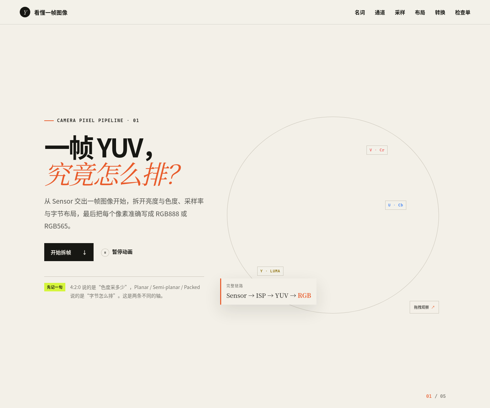

# 看懂一帧图像 · Camera YUV → RGB

一个参考 `Threejs-Quaternion` 视觉与交互方式构建的中文教程，用可视化知识图谱串起 Camera Sensor、YUV 采样、内存布局，以及到 RGB888 / RGB565 的完整转换链路。



## 内容

1. **Y / U / V 的职责**：理解亮度与色度为什么分开保存。
2. **名词解析**：图解 Chroma、Planar、Semi-planar 与 Packed 的准确含义。
3. **色度采样**：比较 4:4:4、4:2:2 与 4:2:0 的共享范围与带宽。
4. **内存布局图谱**：交互对比 I420、YV12、NV12、NV21、YUYV、UYVY。
5. **转换实验室**：切换 BT.601 / BT.709、Full / Limited Range，实时观察 RGB 数值。
6. **输出打包**：拆解 RGB888 与 RGB565 的位宽、精度与字节序。
7. **工程检查单**：覆盖 stride、pixel stride、crop、矩阵、范围与 UV 顺序。

## 本地运行

需要 Node.js 20.19 或更高版本。

```bash
npm install
npm run dev
```

生产构建：

```bash
npm run build
npm run preview
```

## 项目结构

```text
Camera-YUV-Graph/
├── src/
│   ├── main.js
│   └── style.css
├── index.html
├── package.json
└── README.md
```
